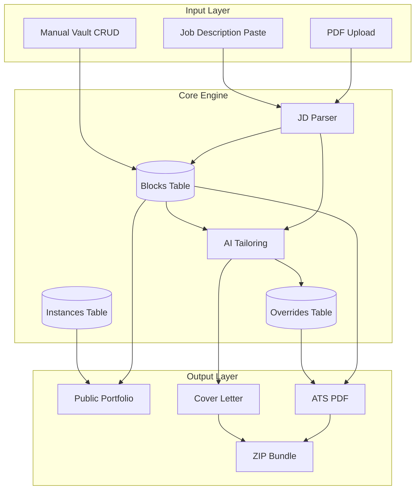

# Data Flow — Dynamic Career Engine

## High-Level Data Flow

## API Design Notes

- **Blocks API:** CRUD for career blocks; filter by type, tags, visibility
- **Instances API:** CRUD for categories; map slugs to tag filters
- **Overrides API:** Create/update/delete per application (instance_id + block_id)
- **AI Endpoints:** JD parse, override suggestions, cover letter generation
- **Export Endpoint:** Generate PDF bundle (CV + cover letter) with overrides applied
